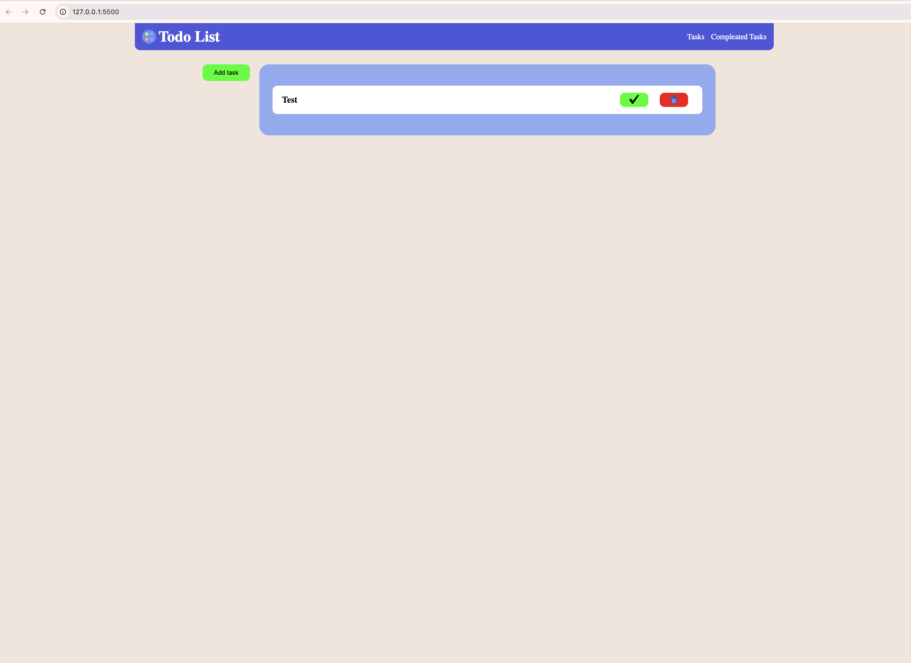
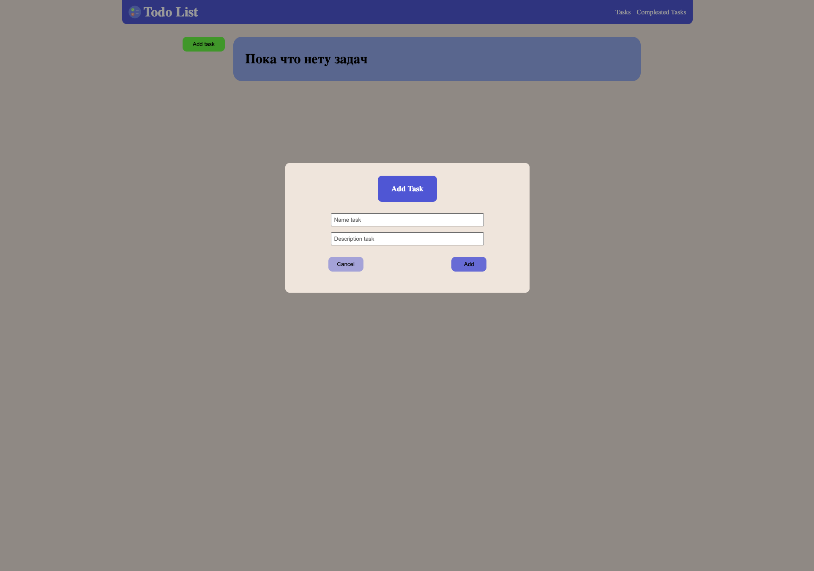

# What is this?
It's simple **Todo List**
You can add tasks, mark them as compleate are tasks and delete theme.

## Example of uses
- Main menu

 
    

- Modal for adding task

    

# Future
Add saving to localStore. I am want add adaptive for phone and other more smaller devices. I will also do a delete for the task that is completed